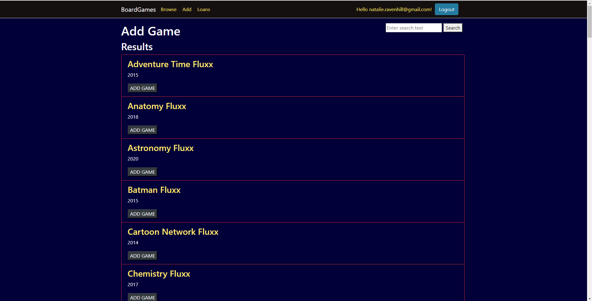
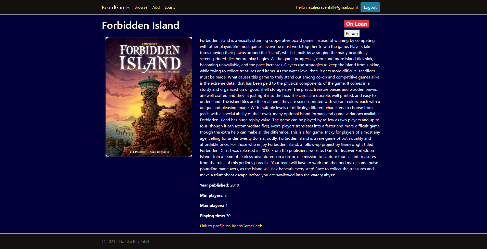
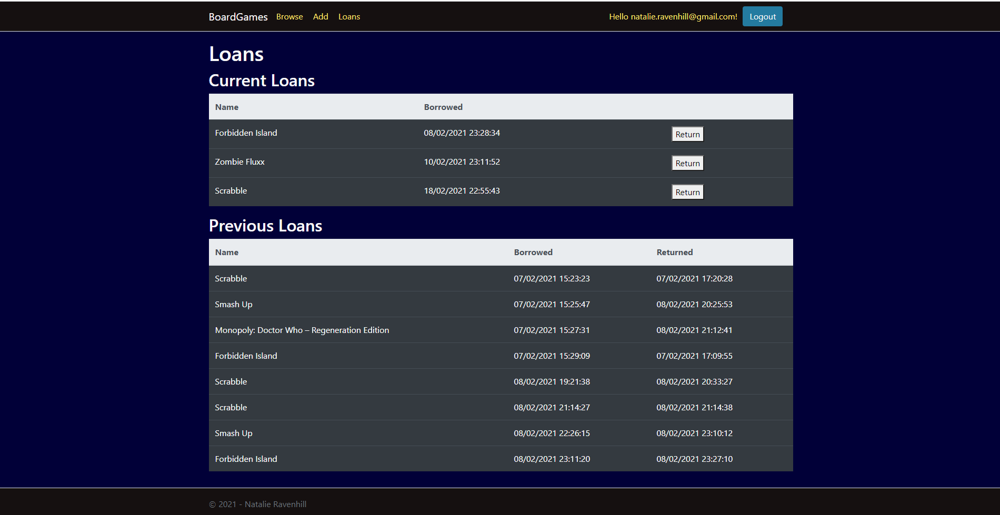

# BoardGames
 I wrote this app to learn more about ASP.NET MVC, and also because I keep leaving board games in different places and forgetting who has them!
 
 I have used ASP.NET Core MVC 3.1 and the ASP.NET Core Identity library for the authentication. The data is stored in a SQL server database and is accessed using Entity Framework Core.
 I used the external login providers for Microsoft, Google and Facebook provided by the ASP Identity library.
 
 The app enables users to
 * Browse the library of board games
 * Add a new game to the library
 * Search for games to add to the library using the [BoardGameGeek API](https://boardgamegeek.com/wiki/page/BGG_XML_API)
 * Loan and return games when logged into the system

#### Limitations:
Ideally I would have liked to use the SendGrid API to send emails, but it requires a custom domain address and I haven't paid up for one right now! Therefore the Gmail address I have set up for this project has a habit of ending up in the receiver's spam folder :(
